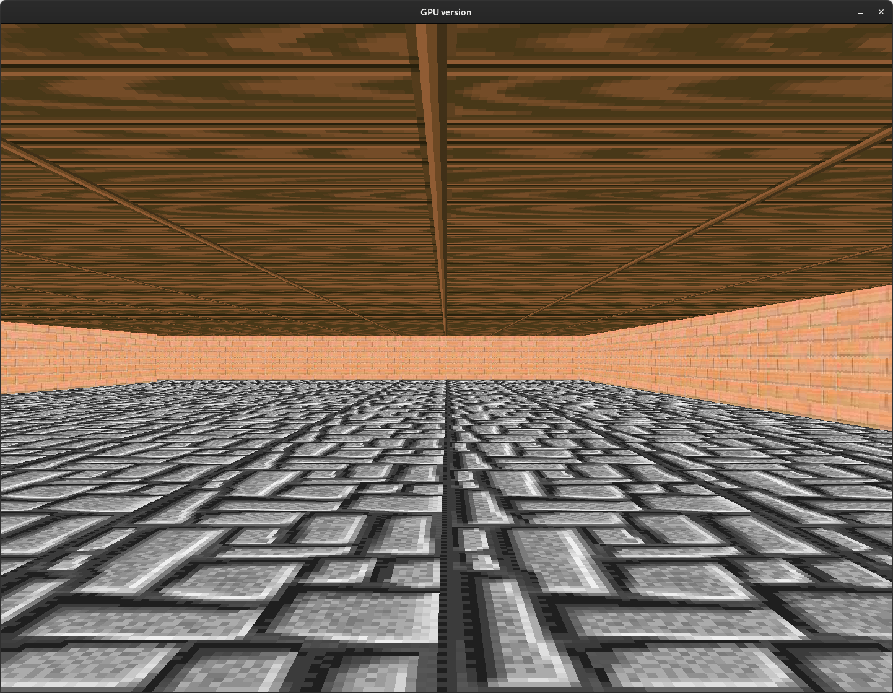

# raycasting-GPU

---

This project is a proof of concept. The goal is to show that raycasting can be accelerated with GPU.
I have used SDL 1.2 on purpose because it uses CPU rendering.
This enable to do some comparison between a full CPU rendering and a GPU rendering.

## Version

We have two differents implementations in cuda:

- `main.cu` is a naive implementation that runs better on IGPU and old GPU.
- `main2.cu` fix the speed variance issue and runs better on recent GPU.

## Build

- **dependencies:** `sdl12-compat` for CPU and GPU version, `cuda` for GPU version and optionally  `hipcc` / `hipify-clang` if you are using AMD/ATI graphic cards.
- **compile:** `make` to build CPU version or `make nvidia` / `make amd`  for GPU version.
- **post-compilation:** you may have to adjust `CAMERA_SPEED` to your GPU performance in the source code `main.h`
